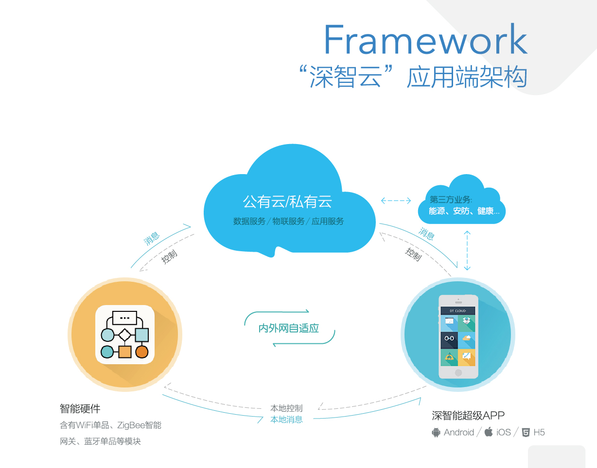
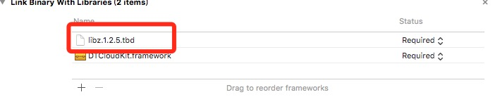
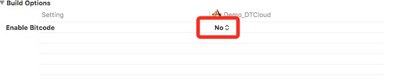

## SDK 概述

### 1. SDK目的与功能
#### 目的
深智云的DTCloudKit封装了手机与深智云硬件，以及手机与服务器通讯的过程，这使得开发者可以更快速的完成APP开发，避免了面对复杂的协议和错误处理，只需要专注于APP用户体验的优化和设计。
#### 功能
SDK封装了手机和设备之间包括配置入网、发现、连接、控制、心跳、状态上报、报警通知等过程。以及设备和云端直接的通讯等服务

#### 实现逻辑


## SDK 集成
### 1. 申请AppID 和 AppKey

登录应用[申请网站](http://manage.dtston.com/#/login)，填写应用信息并提交审核，审核通过后，获取到AppId 和 AppKey。

### 2. 准备环境（请使用真机进行调试）

（1）在工程内导入以下框架，并在build Settings做以下设置。







### 3. DTCloud 使用 (DTCloudManager类)

#### 初始化

```
- (BOOL)application:(UIApplication *)application didFinishLaunchingWithOptions:(NSDictionary *)launchOptions {
	/*
	 *  使用DTCloudKit 要到官网去申请账号生成对应的产品，并把产品的AppId和AppKey用于初始化
	 */
	[[DTCloudManager defaultJNI_iOS_SDK]setSanBox:YES];/*开发环境*/
    [[DTCloudManager defaultJNI_iOS_SDK]setOperationDelegate:self];
    [[DTCloudManager defaultJNI_iOS_SDK]startAppId:DTCloudKitAppId appKey:DTCloudKitAppKey successCallback:nil errorCallback:nil];
	return YES;
}

/**
 *  DTCloud收到设备的命令
 *
 *  @param backCode    返回状态码
 *  @param backContent 返回内容
 *  @param macAddress  设备的标识
 */
- (void)dtCloudManagerMessageReceiveBackCode:(NSString *)backCode backContent:(NSString *)backContent macAddress:(NSString *)macAddress;

/**
 *  发送到DTCloud命令失败
 *
 *  @param cmdtag 失败的命令标识
 */
- (void)dtCloudManagerMessageSendFaild:(NSUInteger)cmdtag;

/**
 *  DTCloud发送的设备上线下线的回调
 *
 *  @param isonline     上线下线
 *  @param macAddress   设备的标识
 */
- (void)dtCloudManagerBackDeviceState:(BOOL)isonline macAddress:(NSString *)macAddress;

/**
 *  DTCloud用户登录凭证过期回调，需重新登录
 */
- (void)dtCloudManagerUserLoginTokenHasExpired;
```

#### DTCloud云平台用户模块

##### 用户登录、注册、退出
```
/**
 登录DTCloud云平台（需登录，才能获取对应用户的设备信息）

 @param username 云平台用户(目前限定：手机号码)
 @param password 云平台密码
 @param successCallback 成功回调
 @param errorCallback 失败回调
 */
- (void)loginWithUsername:(NSString *)username password:(NSString *)password successCallback:(void (^)(NSDictionary *dic))successCallback errorCallback:(void (^)(NSDictionary *dic))errorCallback;

/**
 第三方登录

 @param openID 第三方的uid（要确保唯一）
 @param platformType 类型，1：QQ 2：微信 3：新浪
 @param successCallback 成功回调
 @param errorCallback 失败回调
 */
- (void)loginWithThirdOpenId:(NSString *)openID type:(int)platformType successCallback:(void (^)(NSDictionary *dic))successCallback errorCallback:(void (^)(NSDictionary *dic))errorCallback;

/**
 退出云平台（当退出平台以后，再次使用平台需登录）
 */
- (void)logout;

/**
 获取DTCloud云平台注册验证码

 @param username 注册的用户名(目前限定：手机号码)
 @param successCallback 成功回调
 @param errorCallback 失败回调
 */
- (void)getRegisterCodeWithUsername:(NSString *)username successCallback:(void (^)(NSDictionary *dic)) successCallback errorCallback:(void (^)(NSDictionary *dic)) errorCallback;

/**
 注册DTCloud云平台

 @param username 云平台用户(目前限定：手机号码)
 @param password 云平台密码(目前密码仅支持数字字母常见符号，不支持表情空格等)
 @param vcode 云平台注册验证码
 @param successCallback 成功回调
 @param errorCallback 失败回调
 */
- (void)registerWithUsername:(NSString *)username password:(NSString *)password securityCode:(NSString *)vcode successCallback:(void (^)(NSDictionary *dic)) successCallback errorCallback:(void (^)(NSDictionary *dic)) errorCallback;

/**
 获取DTCloud云平台忘记密码的验证码

 @param username 注册的用户名(目前限定：手机号码)
 @param successCallback 成功回调
 @param errorCallback 失败回调
 */
- (void)getForgetPasswordCodeWithUsername:(NSString *)username successCallback:(void (^)(NSDictionary *dic)) successCallback errorCallback:(void (^)(NSDictionary *dic)) errorCallback;

/**
 重置密码DTCloud云平台

 @param username 云平台用户(目前限定：手机号码)
 @param password 云平台密码(目前密码仅支持数字字母常见符号，不支持表情空格等)
 @param vcode 云平台验证码
 @param successCallback 成功回调
 @param errorCallback 失败回调
 */
- (void)resetPasswordWithUsername:(NSString *)username password:(NSString *)password securityCode:(NSString *)vcode successCallback:(void (^)(NSDictionary *dic)) successCallback errorCallback:(void (^)(NSDictionary *dic)) errorCallback;

/**
 获取用户详细信息

 @param successCallback 成功回调
 @param errorCallback 失败回调
 */
- (void)getUserInformationSuccessCallback:(void(^)(NSDictionary *dic))successCallback errorCallback:(void(^)(NSDictionary *dic))errorCallback;
```


#### DT云平台设备模块

##### 设备绑定与解绑
```
/**
 *  绑定设备
 *
 *  @param deviceName      设备名字
 *  @param macAddress      设备mac地址
 *  @param productId       产品类型
 *  @param successCallback 成功回调
 *  @param errorCallback   失败回调
 */
- (void)bindDeviceByName:(NSString *)deviceName macAddress:(NSString *)macAddress productId:(NSString *)productId successCallback:(void (^)(NSDictionary *dic)) successCallback errorCallback:(void (^)(NSDictionary *dic)) errorCallback;

/**
 *  解绑设备
 *
 *  @param deviceUUID      设备UUID（云平台返回的设备）
 *  @param successCallback 成功回调
 *  @param errorCallback   失败回调
 */
- (void)unBindDeviceByUUID:(NSString *)deviceUUID successCallback:(void (^)(NSDictionary *dic)) successCallback errorCallback:(void (^)(NSDictionary *dic)) errorCallback;
```

##### 获取DTCloud上的所有设备,设备管理由平台管理
```
/**
 获取DTCloud上的所有设备

 @param successCallback 成功回调
 @param errorCallback 失败回调
 */
- (void)getAllDeviceSuccessCallback:(void (^)(NSArray *deviceList))successCallback errorCallback:(void (^)(NSDictionary *dic))errorCallback;

/**
 获取局域网内的所有设备

 @return 获取局域网内的所有设备
 */
- (NSArray *)getAllDeviceInLocalAreaNetwork;

/**
 绑定设备

 @param deviceName 设备名字
 @param macAddress 设备mac地址
 @param productId 产品类型
 @param deviceType 设备种类
 @param successCallback 成功回调
 @param errorCallback 失败回调
 */
- (void)bindDeviceByName:(NSString *)deviceName macAddress:(NSString *)macAddress productId:(NSString *)productId deviceType:(DeviceKindType)deviceType successCallback:(void (^)(NSDictionary *dic))successCallback errorCallback:(void (^)(NSDictionary *dic))errorCallback;

/**
 解绑设备

 @param deviceUUID 设备UUID（云平台返回的设备）
 @param successCallback 成功回调
 @param errorCallback 失败回调
 */
- (void)unBindDeviceByUUID:(NSString *)deviceUUID successCallback:(void (^)(NSDictionary *dic)) successCallback errorCallback:(void (^)(NSDictionary *dic)) errorCallback;

/**
 分享设备

 @param deviceUUID 设备UUID（云平台返回的设备）
 @param username 被分享用户账号
 @param successCallback 成功回调
 @param errorCallback 失败回调
 */
- (void)shareBindDeviceByUUID:(NSString *)deviceUUID username:(NSString *)username successCallback:(void (^)(NSDictionary *dic)) successCallback errorCallback:(void (^)(NSDictionary *dic)) errorCallback;

/**
 重命名设备

 @param deviceUUID 设备UUID（云平台返回的设备)
 @param rename 新名称(目前密码仅支持数字字母常见符号，不支持表情空格等)
 @param successCallback 成功回调
 @param errorCallback 失败回调
 */
- (void)renameDeviceByUUID:(NSString *)deviceUUID andDeviceName:(NSString *)rename successCallback:(void (^)(NSDictionary *dic)) successCallback errorCallback:(void (^)(NSDictionary *dic)) errorCallback;

/**
 修改设备的图片

 @param deviceUUID 设备UUID（云平台返回的设备)
 @param data 图片的数据
 @param successCallback 成功回调
 @param errorCallback 失败回调
 */
- (void)modifyBindDevImageByUUID:(NSString *)deviceUUID andImagedata:(NSData *)data successCallback:(void (^)(NSDictionary *dic))successCallback errorCallback:(void (^)(NSDictionary *dic))errorCallback;
```

##### 控制设备、联网、固件升级
```
/**
 控制命令发送

 @param functionCode 功能码（长度为4的16进制字符串）
 @param functionCommand 控制指令
 @param macAddress 设备MAC地址
 @param type 设备种类
 @param protocolType 协议类型
 @return 0发送成功 1functionCode、functionCommand、macAddress值为空或者长度有误 2发送失败、设备不存在
 */
- (int)sendCommandByFunctionCode:(NSString *)functionCode functionCommand:(NSString *)functionCommand deviceMacAddress:(NSString *)macAddress deviceType:(DeviceKindType)type protocolType:(DTSDKProtocolType)protocolType;

/**
 获取设备的状态

 @param macAddress 设备的mac
 @return 返回yes在线，NO离线
 */
- (BOOL)getDevicesState:(NSString *)macAddress;

#pragma mark - DT云平台联网模块

/**
 开始联网配对(不会自动绑定到云平台，设备绑定到云平台，调用：bindDeviceByName:macAddress:productId:deviceType:successCallback:errorCallback:)

 @param modleType wifi模块类型
 @param productId 产品类型
 @param deviceName 设备名字
 @param wifiSSID wifi名字
 @param wifiPassword wifi的密码
 @param successCallback 成功回调 返回设备对象 -> dic[@"data"]
 @param errorCallback 失败回调
 */
- (void)startDeviceMatchingNetwork:(LinkType)modleType deviceProductId:(NSString *)productId deviceName:(NSString *)deviceName wifiSSID:(NSString *)wifiSSID wifiPassword:(NSString *)wifiPassword successCallback:(void (^)(NSDictionary *dic)) successCallback errorCallback:(void (^)(NSDictionary *dic)) errorCallback;

/**
 停止配对
 */
- (void)stopMatchingNetwork;

#pragma mark - DT云平台固件升级模块

/**
 模块的固件版本 
 errcode 为 1：设备正在进行固件升级  2：固件已是最新版本 0：固件有新版本
 errms 为 结果信息
 @param macAddress 设备地址
 @param type 设备种类
 @param protocolType 使用协议类型
 @param callback 结果回调
 */
- (void)getFirmwareVersionByMacAddress:(NSString *)macAddress deviceType:(DeviceKindType)type protocolType:(DTSDKProtocolType)protocolType resultCallback:(void (^)(NSDictionary *dic))callback;

/**
 模块的固件版本
 errcode 为 1：升级失败 0：升级成功
 errms 为 结果信息

 @param macAddress 设备地址
 @param type 设备种类
 @param protocolType 使用协议类型
 @param callback 结果回调
 */
- (void)updateFirmwareVersionByMacAddress:(NSString *)macAddress deviceType:(DeviceKindType)type protocolType:(DTSDKProtocolType)protocolType resultCallback:(void (^)(NSDictionary *dic))callback;
```
